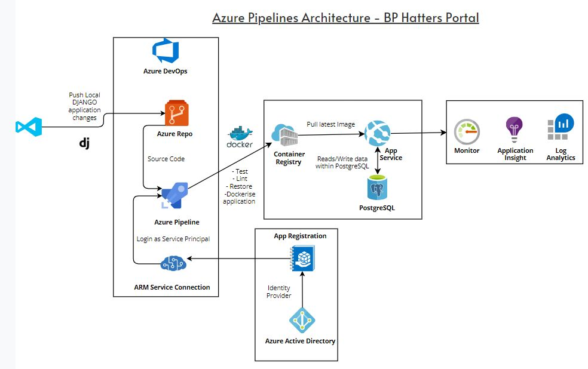

# ⚽ Football Club Finance Portal

This is a Django-based web application designed to help local football clubs manage player payments and club finances. Built with a clean, role-based interface for treasurers and players, the platform streamlines financial tracking, dues collection, and payment visibility.

The application is fully containerized with Docker and ready to be deployed to Azure using modern DevOps practices.

## 🔧 Features
- Treasurer dashboard for managing players and payments
- Player portal to view dues and payment history
- Secure role-based authentication
- Dockerized for easy deployment
- Infrastructure ready for Azure cloud hosting
- Includes GitHub Actions workflow pipeline for deployment to Azure

## 📸 Screenshots

### Azure Architecture - Infrastrcuture Design


### Login Page


### Treasurer Dashboard


### Treasurer Reminder Dashboard


### Players Payment Dashboard


## 🚀 Getting Started

To work with this repository:

### 1. Clone the repository
```bash
git clone https://github.com/mabs-mahbub/Finance-Portal.git
```

### 2. Set up your environment
- Ensure you have Python 3.10+, Docker, and Git installed.
- Create and activate a virtual environment:
  ```bash
  python -m venv env
  source env/bin/activate  # or .\env\Scripts\activate on Windows
  ```
- Install dependencies:
  ```bash
  pip install -r requirements.txt
  ```

### 3. Configure environment variables
- Create a `.env` file based on `.env.example`
- Fill in your database credentials, Django secret key, email details etc.

### 4. Run locally
```bash
python manage.py makemigrations
python manage.py migrate
python manage.py runserver
```

### 5. Run with Docker (optional)
```bash
docker build -t football-club-finance .
docker run -p 8000:8000 football-club-finance
OR
docker run -p 80:80 football-club-finance
```

### 6. Deploy with GitHub Actions
- A sample CI/CD pipeline is included in `.github/workflows/deploy.yml`
- Update the secrets in your GitHub repository settings for Azure deployment

---
