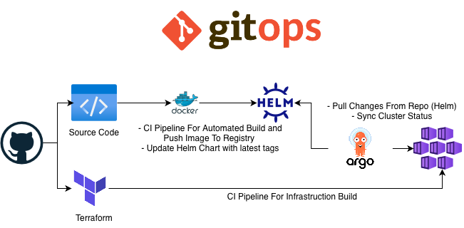
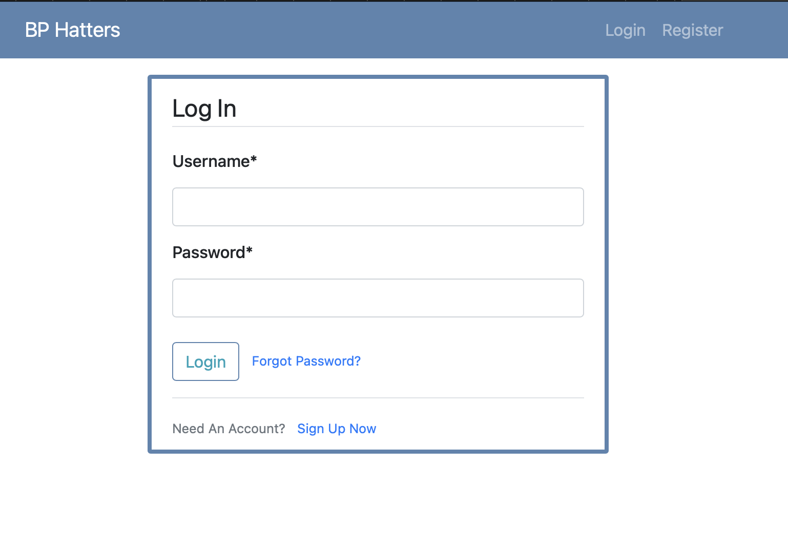
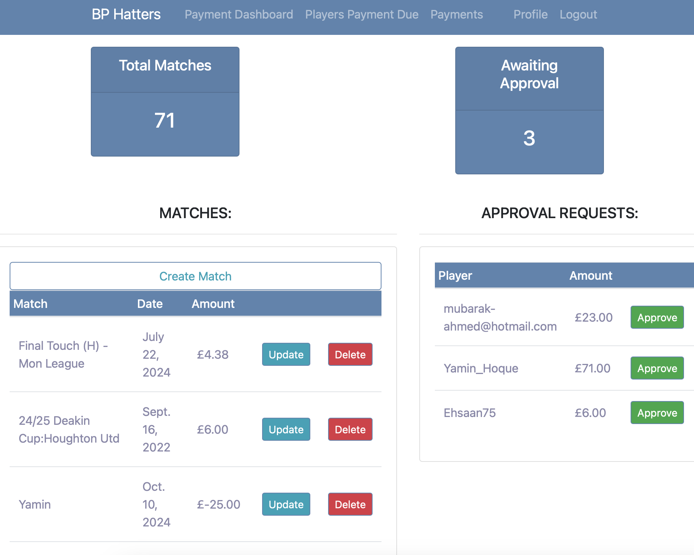
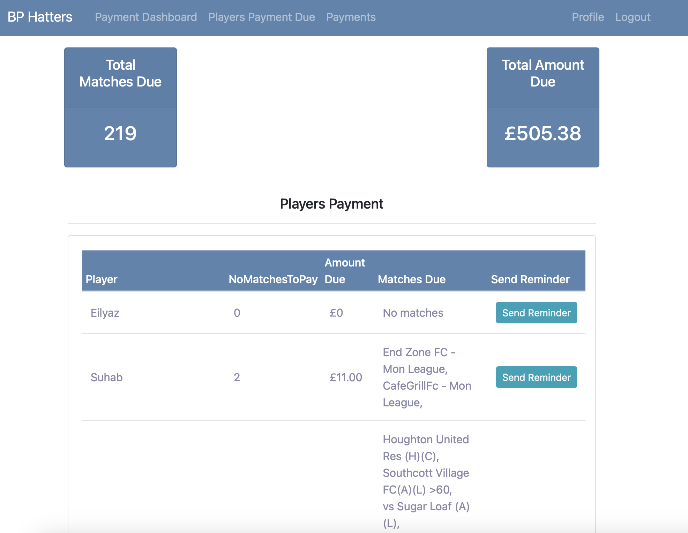
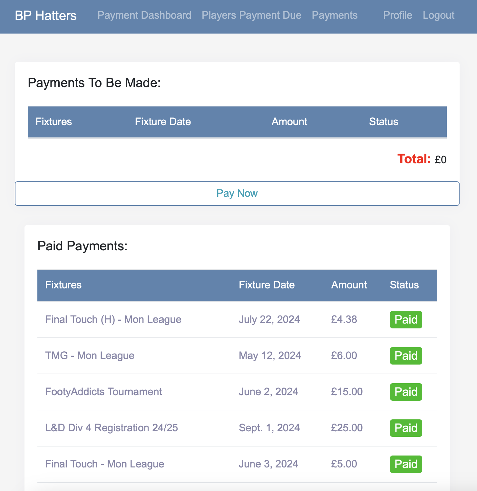

# ⚽ Football Club Finance Portal with GitOps Workflow

A Django-based finance portal for local football clubs to manage players, dues, and payments. This repository is organized around a GitOps workflow: infrastructure is defined with Terraform, application builds are produced by CI/CD, Kubernetes/Helm manage the runtime configuration, and Argo CD keeps the cluster in sync with what is committed here.

## ✨ What’s Included

- **Django web app** with role-based access for treasurers and players
- **Dockerized build** for consistent local and CI/CD builds
- **Terraform infrastructure** for Azure (AKS, ACR, App Gateway)
- **Kubernetes manifests** and **Helm chart** for deployments
- **Argo CD configuration** to continuously reconcile cluster state
- **GitHub Actions** pipelines for Terraform and Docker image builds

## 🧰 Tooling Overview

| Area | Tooling | Purpose |
| --- | --- | --- |
| Web application | Django, Python | Finance portal UI and backend logic. |
| Containerization | Docker | Build and package the Django app as an image. |
| Infrastructure as Code | Terraform | Provision Azure resources like AKS, ACR, App Gateway. |
| CI/CD | GitHub Actions | Build/push Docker images and run Terraform workflows. |
| Kubernetes config | Kubernetes manifests, Helm | Define services, deployments, and chart-driven releases. |
| GitOps | Argo CD | Syncs the cluster with the desired state in this repo. |

## 🗂️ Repository Tree (Detailed)

```
.
├── Application
│   ├── Dockerfile               # Application container build
│   ├── manage.py                # Django entry point
│   ├── requirements.txt         # Python dependencies
│   ├── .env.example             # Environment variable template
│   ├── django_project/          # Django project settings and URL config
│   ├── users/                   # User management app (auth, profiles, signals)
│   ├── matchpayments/           # Payment/dues functionality
│   ├── blog/                    # Blog/announcement app
│   ├── staticfiles/             # Collected static assets placeholder
│   └── README.md                # App-specific setup notes
├── Terraform
│   ├── providers.tf             # Azure provider configuration
│   ├── variables.tf             # Terraform inputs
│   ├── aks.tf                   # AKS cluster resources
│   ├── acr.tf                   # Azure Container Registry
│   └── appgw.tf                 # Application Gateway / networking
├── Kubernetes
│   ├── deployment.yml           # Deployment definition
│   ├── service.yml              # Service definition
│   └── secret.yml               # Secret template
├── Helm
│   └── finance-portal-app
│       ├── Chart.yaml           # Helm chart metadata
│       ├── values.yaml          # Chart values (image, env, replicas)
│       └── templates/           # Deployment/service/ingress templates
├── ArgoCD
│   ├── application.yaml         # Argo CD Application resource
│   └── argoRepo.yml              # Repository credential configuration
├── .github/workflows
│   ├── docker-image.yml         # Docker build/push workflow
│   └── terraform.yml            # Terraform plan/apply workflow
└── README.md                    # You are here
```

## 🧭 GitOps Workflow (End-to-End)

This repository is structured to support a GitOps lifecycle from infrastructure provisioning to application deployment.

1. **Infrastructure (Terraform)**
   - Terraform defines Azure resources such as AKS, ACR, and App Gateway in `Terraform/`.
   - The GitHub Actions workflow in `.github/workflows/terraform.yml` plans and applies changes.

2. **Build & Publish (CI/CD + Docker)**
   - The Django application in `Application/` is built with the `Application/Dockerfile`.
   - `.github/workflows/docker-image.yml` builds and pushes the image to ACR (or another registry).

3. **Runtime Configuration (Kubernetes + Helm)**
   - Base Kubernetes manifests live in `Kubernetes/`.
   - A Helm chart in `Helm/finance-portal-app/` provides templated deployments.
   - CI/CD updates image tags in Helm values or manifests as part of the release process.

4. **Continuous Reconciliation (Argo CD)**
   - `ArgoCD/application.yaml` tells Argo CD to watch this repo and apply Kubernetes/Helm changes.
   - When CI/CD updates manifests or Helm values, Argo CD detects the change and syncs the cluster.

This flow ensures that **git is the single source of truth**: any change committed here is what the cluster eventually runs.

## 🚀 Getting Started (Local)

1. **Clone the repository**
   ```bash
   git clone https://github.com/mabs-mahbub/Finance-Portal.git
   ```

2. **Set up Python**
   ```bash
   python -m venv env
   source env/bin/activate  # or .\env\Scripts\activate on Windows
   pip install -r Application/requirements.txt
   ```

3. **Configure environment variables**
   - Copy `Application/.env.example` to `Application/.env` and fill in values.

4. **Run locally**
   ```bash
   cd Application
   python manage.py makemigrations
   python manage.py migrate
   python manage.py runserver
   ```

5. **Build & run with Docker (optional)**
   ```bash
   cd Application
   docker build -t football-club-finance .
   docker run -p 8000:8000 football-club-finance
   ```

## 📸 Screenshots

### GitOps Workflow


### Login Page


### Treasurer Dashboard


### Treasurer Reminder Dashboard


### Players Payment Dashboard

